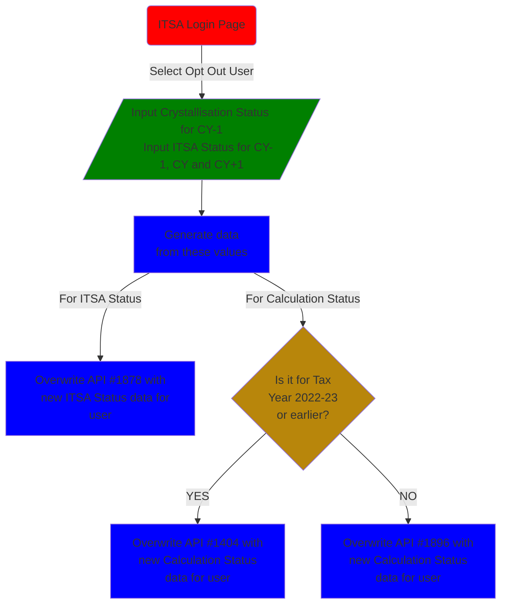

```mermaid
flowchart TD

    style A fill: red
    style B fill: green
    style C fill: blue
    style D fill: blue
    style E fill: #B8860B
    style F fill: blue
    style G fill: blue

    A(ITSA Login Page) -->|Select Opt Out User| B
    B[/ Input Crystallisation Status for CY-1
    Input ITSA Status for CY-1, CY and CY+1 /]
    B --> C[Generate data
    from these values]
    C --> |For Calculation Status| E{Is it for Tax
    Year 2022-23
    or earlier?}
    C --> |For ITSA Status| D[Overwrite API #1878 with
    new ITSA Status data for user]
    E --> |YES| F[Overwrite API #1404 with
    new Calculation Status
     data for user]
    E --> |NO| G[Overwrite API #1896 with
    new Calculation Status
     data for user]

```